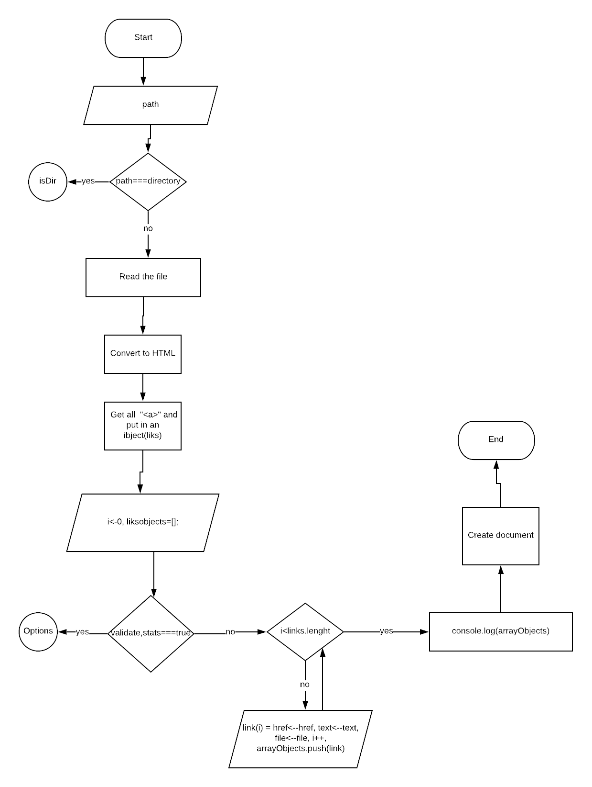
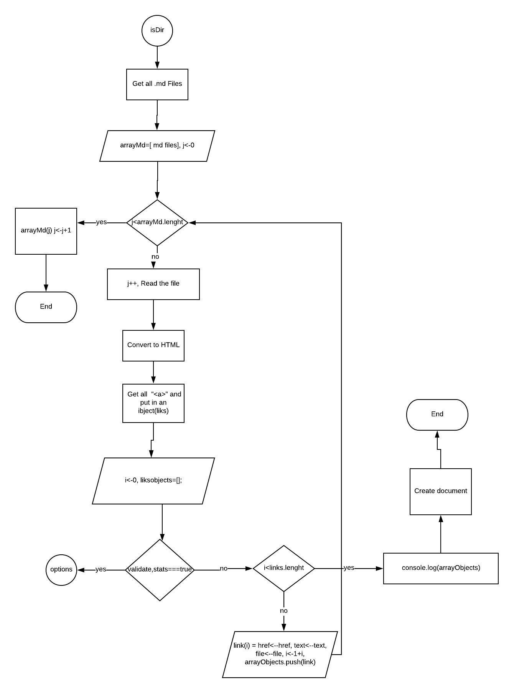
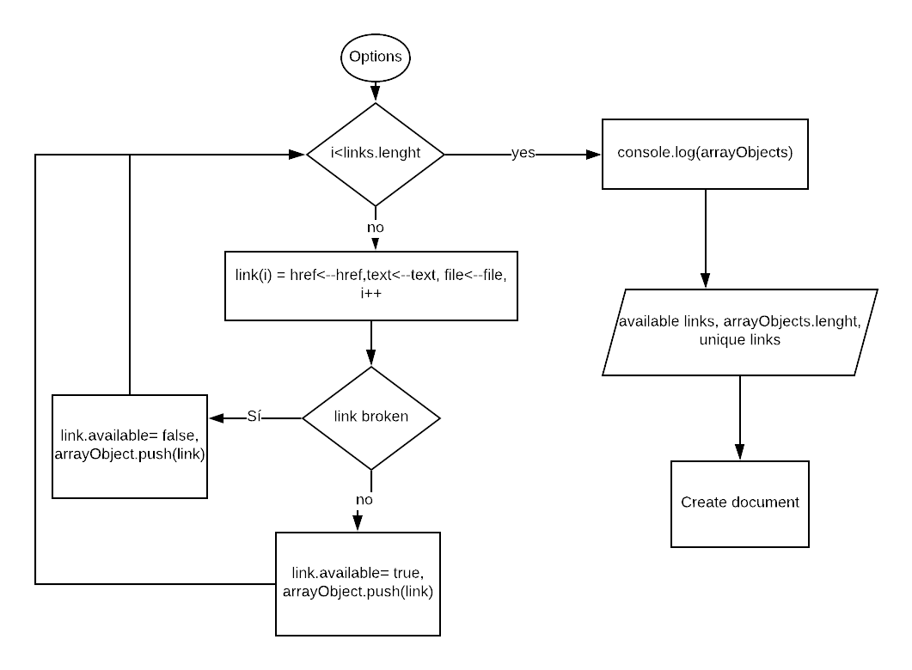

# Markdown Links
**Markdown Links** is a tool for identify all the links that are inside of a file with .md extension or web page, and also helps you to identify broken and live links, and get a stats about those links like; how many links are inside your file, how many of them are alive, and wich ones are repeated.

With this tool you can also search for all the .md files inside a directory and perform all the aformentioned tasks.

At the end, it will generate a file called mdLinks.txt located inside the same directory where you are executing the file from, with a response to your request.

## MarkdownLinks uses:

- [Markdown](https://github.com/evilstreakmarkdown-js) to transform the .md in HTML
>$npm install markdown

- [Cheerio](https://github.com/cheeriojs/cheerio) to extract the links 
>$npm install cheerio 

- [node-fetch](https://www.npmjs.com/package/node-fetch) for the HTTP request 
>$npm i node-fetch

## Prerequisites: 
- [Node.js 11.13.4.](https://nodejs.org/)

## You can install Markdown Links using:

> $npm install Nathalis/GDL002-md-links

## How to use it

>$ mdLinks (path, options)

### Arguments

`path:`absolute or relative path for a file, directory or URL. If the route is relative it resolves respect to the current working directory.

  [Cheerio](https://github.com/)

`options:`
- validate: if you want to validate the found links.
- stats: if you want to know the statistics about the links ( Total links and total unique links).
- validate-stats: to show the statistics about the links including validation (Total links, total unique links and total available links.

### Response

All links in the next format

>{
href: URL.
text: Text in the link
file: Path
}

## CLI (Command Line Interface)

For use in CLI enter in the console

>md-Links "path-to-file" --options

### Example:

### **without options**

>$md-Links "../file.md"
or for an absolute path
>$md-Links "C:/Users/directory/file.md"

**NOTE** Don´t forget to use " "for the arguments and scape the backslashes ( \ ) or use forward slash ( / ).

Print in the console the found links in the file and create a document with a list of all them, each link object include the href, text and file.

### **with options**
$md-Links "../file.md" --validate

Prints in the console a list of all the links included in the file, and also creates a file with all the links inside of it, each link object include the href, text, file, and available.

>$ mdLinks.mdLinks "../file.md" --stats

Prints in the console a list of all the links included in the file, the found links in the file and create a document with a list of all them, each link object include the href, text and file, includes the statistics:
- Total links.
- Total unique links.

>$ md-Links "../file.md" --validate--stats

Prints in the console a list of all the links included in the file, the found links in the file and create a document with a list of all them, each link object include the href, text and file, and available, inclides the statistics: total links.
- Total links
- Total unique links.
- Total available links.

# Flow diagram
## File case

## Directory case

## Options case

